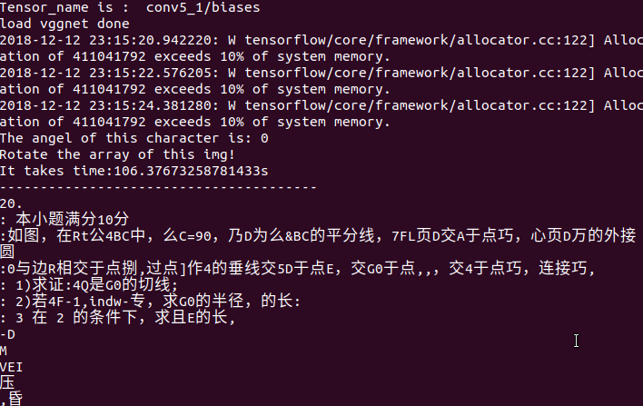

# 本文基于tensorflow、keras/pytorch实现对自然场景的文字检测及端到端的OCR中文文字识别

# 功能
- 文字检测 实现keras端到端的文本检测及识别（项目里面有两个模型keras和pytorch。）
- 不定长OCR识别


## Ubuntu下环境构建
``` 
Bash
##GPU环境
sh setup-python3-gpu.sh

##CPU python3环境
sh setup-python3-cpu.sh

##额外依赖的安装包
apt install graphviz
pip3 install graphviz
pip3 install pydot
pip3 install torch torchvision

```

# 模型
* 一共分为3个网络
* 	**1. 文本方向检测网络-Classify(vgg16)**
*  **2. 文本区域检测网络-CTPN(CNN+RNN)**
*  **3. EndToEnd文本识别网络-CRNN(CNN+GRU/LSTM+CTC)**

# 文字方向检测-vgg分类
```
基于图像分类，在VGG16模型的基础上，训练0、90、180、270度检测的分类模型.
详细代码参考angle/predict.py文件，训练图片8000张，准确率88.23%
```
模型地址[BaiduCloud](https://pan.baidu.com/s/1ZxCtfYA24OTxFPVdUjQHtw)

# 文字区域检测CTPN
支持CPU、GPU环境，一键部署，
[文本检测训练参考](https://github.com/eragonruan/text-detection-ctpn)  
 

# OCR 端到端识别:CRNN
## ocr识别采用GRU+CTC端到到识别技术，实现不分隔识别不定长文字
提供keras 与pytorch版本的训练代码，在理解keras的基础上，可以切换到pytorch版本，此版本更稳定

# 使用
## 体验

运行demo.py或者pytorch_demo.py（建议）  写入测试图片的路径即可，如果想要显示ctpn的结果，修改文件./ctpn/ctpn/other.py 的draw_boxes函数的最后部分，cv2.inwrite('dest_path',img)，如此，可以得到ctpn检测的文字区域框以及图像的ocr识别结果
* 在进行体验的时候，注意要更改里面的一些内容（比如模型文件等）
## 模型训练
### 1 对ctpn进行训练
* 定位到路径--./ctpn/ctpn/train_net.py
* 预训练的vgg网络路径[VGG_imagenet.npy](https://pan.baidu.com/s/1JB15vCByczaSc3rSulCj5g)
将预训练权重下载下来，pretrained_model指向该路径即可,
此外整个模型的预训练权重[checkpoint](https://pan.baidu.com/s/1nFHqw0gp0znObs-5OnyrJw)
* ctpn数据集[还是百度云](https://pan.baidu.com/s/1TzJDcCNlDQVr3GGT1IDhQQ)
数据集下载完成并解压后，将.ctpn/lib/datasets/pascal_voc.py 文件中的pascal_voc 类中的参数self.devkit_path指向数据集的路径即可

### 2 对crnn进行训练
* keras版本 ./train/keras_train/train_batch.py  model_path--指向预训练权重位置 
MODEL_PATH---指向模型训练保存的位置
[keras模型预训练权重](https://pan.baidu.com/s/1vm8NN_Bvsu96_sPJiAWA-Q)
* pythorch版本./train/pytorch-train/crnn_main.py
```
parser.add_argument(
    '--crnn',
    help="path to crnn (to continue training)",
    default=预训练权重的路径，看你下载的预训练权重在哪啦)
parser.add_argument(
    '--experiment',
    help='Where to store samples and models',
    default=模型训练的权重保存位置,这个自己指定)
```
[pytorch预训练权重](https://pan.baidu.com/s/17EBrK67D2tiQM5UU5KboRQ)


## 文字检测及OCR识别结果

`===========================================================`

`===========================================================`


主要是因为训练的时候，只包含中文和英文字母，因此很多公式结构是识别不出来的

## 在跑的过程中遇到了问题，请联系
  邮箱：deamoncao@163.com

## 参考
- https://github.com/xiaofengShi/CHINESE-OCR
- [pytorch 实现crnn](https://github.com/meijieru/crnn.pytorch.git)    
- [keras-crnn 版本实现参考](https://www.zhihu.com/question/59645822)  
- [tensorflow-crnn](https://github.com/ilovin/lstm_ctc_ocr)
- [tensorflow-ctpn](https://github.com/eragonruan/text-detection-ctpn )
- [CAFFE-CTPN](https://github.com/tianzhi0549/CTPN)


